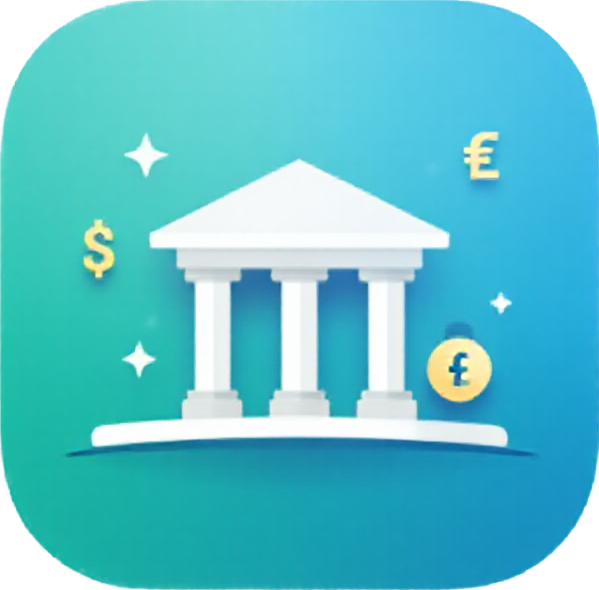

<!-- PROJECT LOGO -->
 

  

  <h3 align="center">C++ To-Do List</h3>

  

    A full-featured banking application developed in Java, showcasing advanced programming skills and modern software development principles.
     
    <a href="https://github.com/Niks-Kozlovs/ToDoList/tree/master">View Original Version</a> ·
    <a href="https://github.com/Niks-Kozlovs/Bankas-aplikacija/issues/new">Report Bug</a> ·
    <a href="https://github.com/Niks-Kozlovs/Bankas-aplikacija/issues/new?labels=enhancement">Request Feature</a>
  

---

<!-- TABLE OF CONTENTS -->

    
Table of Contents

    <ol>
        <li><a href="#about-the-project">About The Project</a></li>
        <li><a href="#features">Features</a></li>
        <li><a href="#principles-and-best-practices">Principles and Best Practices</a></li>
        <li><a href="#built-with">Built With</a></li>
        <li><a href="#getting-started">Getting Started</a>
            <ul>
                <li><a href="#prerequisites">Prerequisites</a></li>
                <li><a href="#installation">Installation</a></li>
            </ul>
        </li>
        <li><a href="#usage">Usage</a></li>
        <li><a href="#license">License</a></li>
        <li><a href="#contact">Contact</a></li>
        <li><a href="#acknowledgments">Acknowledgments</a></li>
    </ol>

---

## About The Project

"Bankas-aplikacija" is a comprehensive banking application designed to simulate real-world banking operations. Developed with a focus on clean code and efficient design patterns, this project reflects my growth as a software engineer, highlighting proficiency in Java and related technologies. Of course this is not a real banking application, so the user has the option to add or remove money from the account without any real consequences. Also even though the view and controllers are separate, it is not a client-server application, so any user can access and change data how they want.

## Features

- **Account Management**: Open, close, and manage multiple bank accounts.
- **Customer Profiles**: Create and maintain detailed customer information.
- **Transaction Processing**: Execute deposits, withdrawals, and transfers securely.
- **Authentication**: Secure login system with user role management.
- **User Interface**: Interactive GUI built with JavaFX for an intuitive user experience.
- **Database Integration**: Persistent data storage using MySQL or Dockerized database setup.
- **Reporting**: Generate transaction histories and account statements.
- **Error Handling**: Robust exception management for application stability.

## Principles and Best Practices

This project embodies several key software development principles and best practices:

- **Object-Oriented Programming (OOP)**: Utilizes encapsulation, inheritance, and polymorphism to create modular and reusable code.
- **Model-View-Controller (MVC) Architecture**: Separates business logic, user interface, and input control for better maintainability.
- **SOLID Principles**: Applies the SOLID principles to enhance code scalability and flexibility.
- **Design Patterns**: Implements patterns like Singleton, Observer, and Factory to solve common design problems.
- **Clean Code Standards**: Follows industry standards for code readability and maintainability.
- **Version Control with Git**: Employs Git for effective source code management and collaboration.
- **Continuous Learning**: Integrates new technologies and methodologies to stay current in the ever-evolving software development landscape.

---

## Built With

---

## Getting Started

To get a local copy up and running, follow these steps.

### Prerequisites

- **Java Development Kit (JDK) 17 or later**
- **JavaFX SDK**
- **MySQL Server** or **Docker** for database setup
- **IDE of your choice** (e.g., Visual Studio Code with Java extensions)

### Installation

1. **Clone the Repository**
2. **Install JavaFX**
     - Download the JavaFX SDK from the official website.
     - Configure your IDE to include the JavaFX libraries.
3. **Set Up the Database**
     - **Option 1: MySQL**
         - Install MySQL Server.
         - Create a new database for the application.
         - Update the database connection settings in the application's configuration files.
     - **Option 2: Docker**
         - Install Docker Desktop.
         - Run the provided Docker Compose file to set up a MySQL container.
4. **Import the Project into Your IDE**
     - Open your IDE and import the project.
     - Ensure all dependencies are correctly configured.
5. **Run the Application**
     - Build and run the application from your IDE.
     - Alternatively, use the command line to compile and execute the application.

## Usage

- **Log In or Register**: Start by creating a new user account or logging in with existing credentials.
On first launch it generates a default admin account with email `admin@admin.com` and password `admin`.

https://github.com/user-attachments/assets/1265eed9-2a8c-4a32-9a3c-e6fce3ebd17a

- **Navigate the Dashboard**: Access various features like account management and transaction processing.
- **Perform Transactions**: Deposit or withdraw funds, transfer money between accounts.

https://github.com/user-attachments/assets/805e6d79-19da-4615-8818-70a60f63f513

- **Manage Profiles**: Update customer information and manage user settings.

https://github.com/user-attachments/assets/bebe50b3-9028-4f24-95d7-ea35424fcd81

https://github.com/user-attachments/assets/a8fea74b-ae2f-4c70-9328-2003f7838284

- **Generate Reports**: View account statements and transaction histories.

## License

Distributed under the MIT License. See LICENSE.txt for more information.

## Contact

Niks Kozlovs - [@NiksKozlovs](https://x.com/NiksKozlovs) - kozlovs.niks1@gmail.com

[product-screenshot]: Resources/ProjectImage.png
[CPP]: https://img.shields.io/badge/-C++-blue?logo=cplusplus&style=for-the-badge